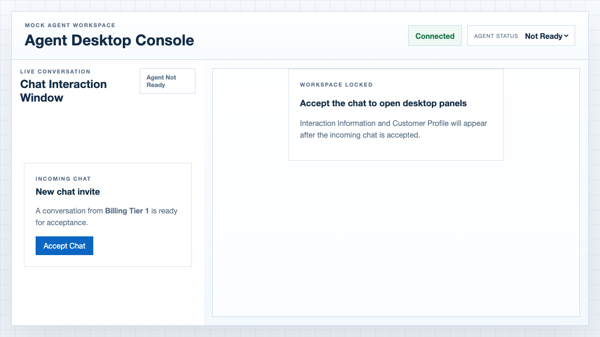
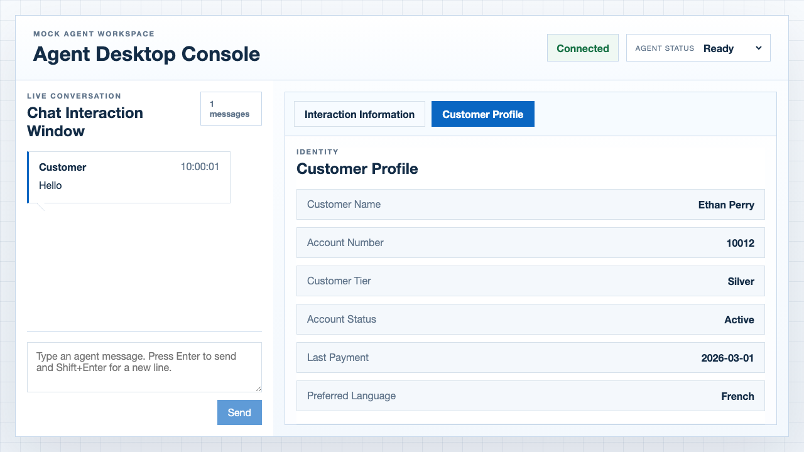
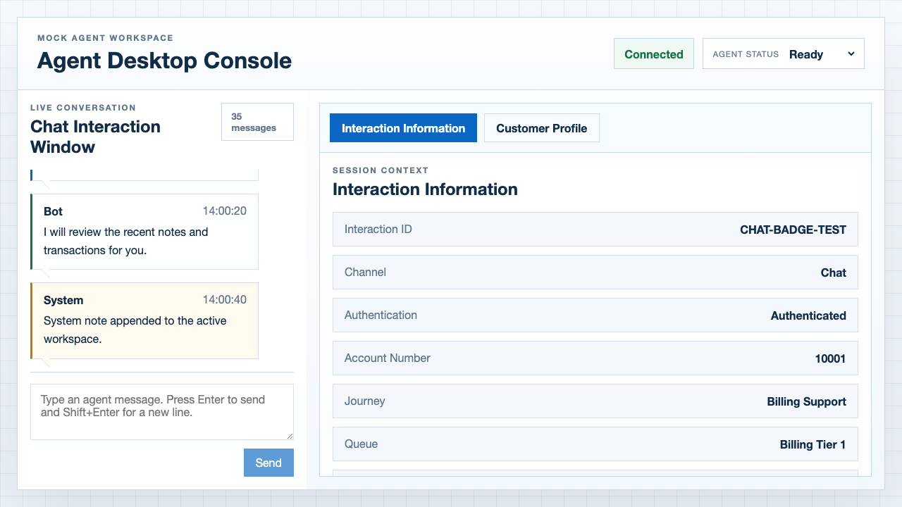

# Bug Report

Automation run date: 2026-03-17

Test run summary:
- Total: 31 tests
- Passed: 24
- Failed: 7
- Failed tests mapped to 5 distinct desktop bugs

---

## Bug #1: Chat invite appears when agent status is `Not Ready`

**Severity:** Medium

**Failing tests:**
- `TC-02: Chat invite appears only when agent status is Ready`
- `TC-03: Chat invite remains hidden when agent moves from Offline to Not Ready`

**Steps to reproduce:**
1. Create a test run with an authenticated payload such as `PAYLOAD_HAPPY_PATH`.
2. Open `/desktop/{runId}`.
3. Keep the agent in `Offline`, then switch the agent status to `Not Ready`.
4. Observe the entry-flow area.

**Expected result:**
- The chat invite should stay hidden until the agent status is `Ready`.

**Actual result:**
- The desktop renders `New chat invite` while the agent status is still `Not Ready`.

**Screenshot:**



---

## Bug #2: Customer Profile transaction list only renders the first page of rows

**Severity:** Medium

**Failing tests:**
- `TC-11: Customer profile transaction list renders the expected rows`

**Steps to reproduce:**
1. Create an authenticated run for account `10012`.
2. Accept the chat invite and open the `Customer Profile` tab.
3. Compare the rendered transaction rows with `test-data/profiles/10012.json`.

**Expected result:**
- All `23` transactions from the sample profile should be rendered for validation.

**Actual result:**
- The profile header says `23 items`, but only `10` transaction rows are rendered on the page and the UI shows `Page 1 of 3`.

**Screenshot:**



---

## Bug #3: Chat message-count badge stops incrementing after 35 messages

**Severity:** Medium

**Failing tests:**
- `TC-17: Badge count matches the large transcript count`
- `TC-20: Badge count continues to increment after a large transcript`

**Steps to reproduce:**
1. Create a run with `PAYLOAD_LARGE_CONVERSATION` so the transcript contains `60` messages.
2. Open `/desktop/{runId}` and accept the chat invite.
3. Observe the badge in the chat window header.
4. Optionally send one additional live chat message and wait for the echo reply.

**Expected result:**
- The badge should match the full rendered transcript count.
- With the base payload it should show `60`.
- After sending one agent message and one echo reply it should show `62`.

**Actual result:**
- The badge stops at `35` and does not continue incrementing, even after additional messages are appended.

**Screenshot:**



**Note:** This bug is reportedly fixed in `/desktopv2`.

---

## Bug #4: API rejects empty chatTranscript array

**Severity:** Medium

**Failing tests:**
- `TC-24: API rejects empty chatTranscript (Bug #4)`

**Steps to reproduce:**
1. Send a POST request to `/api/testrun` with a valid payload
2. Set `chatTranscript: []` (empty array)
3. Observe the response

**Expected result:**
- The API should accept an empty chat transcript
- The desktop should open with no messages in the transcript
- Badge count should show 0
- Agent should be able to send the first message

**Actual result:**
```json
{
  "error": "VALIDATION_ERROR",
  "message": "Request validation failed",
  "timestamp": "2026-03-17T19:40:03.253023905Z",
  "details": ["chatTranscript: must not be empty"]
}
```

**Business impact:**  
This prevents testing scenarios where an agent opens a fresh conversation with no prior context or bot interaction. In real-world usage, agents may encounter conversations that haven't had any messages yet.

**Recommendation:**
Update API validation to allow empty `chatTranscript` arrays. An empty conversation is a valid business scenario.

---

## Bug #5: Message length hard limit of 1000 characters

**Severity:** Low  

**Failing tests:**
- `TC-31: Very long message with special characters`

**Steps to reproduce:**
1. Create a payload with a message longer than 1000 characters
2. Send POST request to `/api/testrun`
3. Observe the validation error

**Test results:**
```
Message length 500:  ✓ Accepted (201)
Message length 1000: ✓ Accepted (201)
Message length 1200: ✗ Rejected (400)
Message length 1500: ✗ Rejected (400)
Message length 2000: ✗ Rejected (400)
```

**Error message:**
```json
{
  "error": "VALIDATION_ERROR",
  "message": "Request validation failed",
  "details": ["chatTranscript[0].message: size must be between 0 and 1000"]
}
```

**Expected result:**
- Either: The limit should be documented and enforced in the UI with a character counter
- Or: The limit should be higher (e.g., 2000-5000 chars) to accommodate longer customer inquiries
- Or: The UI should show a warning when approaching the limit

**Actual result:**
- Messages over 1000 characters are silently rejected by the API
- No UI feedback about the limit (needs verification if live chat has the same constraint)

**Business impact:**  
- Users may type long messages and lose content if it exceeds 1000 characters
- No visual feedback in the UI about the limit
- Customer service scenarios may require longer context (e.g., copying error messages, providing detailed issues)

**Recommendations:**
1. Add character counter to the live chat input field
2. Display warning when approaching 1000 character limit
3. Consider increasing limit to 2000-5000 characters for complex customer issues
4. Add `maxlength="1000"` attribute to textarea if limit must remain
5. Show user-friendly error message if message exceeds limit

---

## Summary

**Total bugs:** 5  
**Critical:** 0  
**Medium:** 4 (Bugs #1, #2, #3, #4)  
**Low:** 1 (Bug #5)

**Security status:** ✅ All security tests passed
- XSS protection working correctly
- SQL injection patterns rejected
- Input validation strong
- Unicode/emoji support good

---

## Related Documents

- [test-report.md](./test-report.md) - Full test coverage and results
